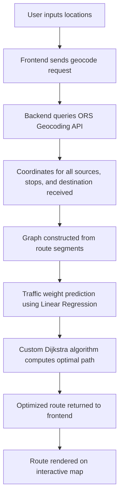

# Route Optimizer : Full Stack DSA + Web Dev Project

Route Optimizer is a full stack web application that computes the most optimized travel route using a **custom implementation of Dijkstra’s Algorithm** and visualizes it on an interactive map. The project bridges core Data Structures and Algorithms concepts with real world web mapping, authentication, and predictive modeling.

The application is built using **React.js**, **Tailwind CSS**, **FastAPI**, **MongoDB**, and **OpenRouteService**, with an emphasis on algorithmic correctness, clean architecture, and extensibility toward production grade systems.

---
## WorkFlow :

---

##  Features

-  Enter **source and destination** cities
-  Calculate the **shortest path using Dijkstra's Algorithm**
- **Multi source routing support** with intermediate stops and saved route configurations
-  Visualize the route using **Leaflet.js** on an interactive map
-  Save and manage your favorite routes 
-  View real-time **distance, duration, and travel mode**
- **Save**, **view**, and **manage** user specific routes with authentication
-  Responsive mobile/desktop UI

---

## Multi Source Routing and Traffic Prediction

The system supports routes with multiple sources, intermediate stops, and a final destination. Each segment is treated as a graph edge.

Traffic conditions are modeled as a dynamic weight modifier using a Linear Regression model trained on historical distance, time, and congestion indicators. The predicted traffic factor is applied before running Dijkstra’s Algorithm to produce more realistic routes.

This design allows seamless future upgrades to more advanced machine learning models without changing the routing pipeline.

##  Why This Project Is Special

This isn’t just another travel planner. It combines:
- **Machine Learning Integration** : Traffic impact estimation using Linear Regression, forming the foundation for future upgrades to advanced models like XGBoost or ensemble methods.
-  **DSA Concepts**: Dijkstra's algorithm applied in real-world mapping
-  **Full-Stack Development**: Clean architecture using React & Node
-  **OpenStreetMap Data**: Free, open-source routing via OpenRouteService
-  **Algorithm Visualization Meets Practical Usage**

---
## Note :
On first load (especially after a period of inactivity), you may notice a short delay in:

 Displaying optimized routes

 Login and Signup actions

This is due to backend startup time and MongoDB cold connection latency (especially in local or free-hosted environments).
Subsequent requests will be much faster once the server is warmed up. 
---

##  Tech Stack

| Layer        | Tools & Libraries                                   |
|--------------|-----------------------------------------------------|
| **Frontend** | React.js, Tailwind CSS, React Router, Leaflet.js    |
| **Backend**  | FastAPI    |
| **Database**  | MongoDB    |
| **ML algorithm**  | Linear regression, Planned upgrades to XGBoost or decision tree based models    |
| **Routing API** | OpenRouteService API (OpenStreetMap data)       |
| **Algorithms** | Dijkstra’s Algorithm (custom implemented)         |
| **Tools**    | Vite, Git, GitHub                                   |

---
##  License

This project is licensed under the MIT License - see the [LICENSE](./LICENSE) file for details.

