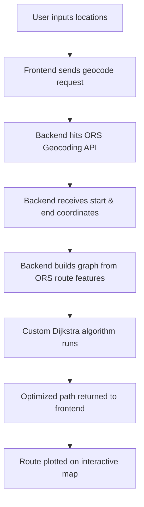

# Route Optimizer — Full Stack DSA + Web Dev Project

A full-stack web application that calculates the **most optimized route using Dijkstra’s Algorithm** and visualizes it beautifully on an interactive map with **Leaflet.js**. 

Built with **React.js**, **Tailwind CSS**, **Node.js**, **Express.js**, and **OpenRouteService**, this project combines **Data Structures & Algorithms** with modern web development practices.

---
## WorkFlow :

---

##  Features

-  Enter **source and destination** cities
-  Calculate the **shortest path using Dijkstra's Algorithm**
-  Visualize the route using **Leaflet.js** on an interactive map
-  Save and manage your favorite routes 
-  View real-time **distance, duration, and travel mode**
-  Responsive mobile/desktop UI

---

##  Why This Project Is Special

This isn’t just another travel planner. It combines:
-  **DSA Concepts**: Dijkstra's algorithm applied in real-world mapping
-  **Full-Stack Development**: Clean architecture using React & Node
-  **OpenStreetMap Data**: Free, open-source routing via OpenRouteService
-  **Algorithm Visualization Meets Practical Usage**

---
## Note :
On first load (especially after a period of inactivity), you may notice a short delay in:

 Displaying optimized routes

 Login and Signup actions

This is due to backend startup time and MongoDB cold connection latency (especially in local or free-hosted environments).
Subsequent requests will be much faster once the server is warmed up. 
---

##  Tech Stack

| Layer        | Tools & Libraries                                   |
|--------------|-----------------------------------------------------|
| **Frontend** | React.js, Tailwind CSS, React Router, Leaflet.js    |
| **Backend**  | Node.js, Express.js, MongoDB                                 |
| **Routing API** | OpenRouteService API (OpenStreetMap data)       |
| **Algorithms** | Dijkstra’s Algorithm (custom implemented)         |
| **Tools**    | Vite, Git, GitHub                                   |

---
##  License

This project is licensed under the MIT License - see the [LICENSE](./LICENSE) file for details.

